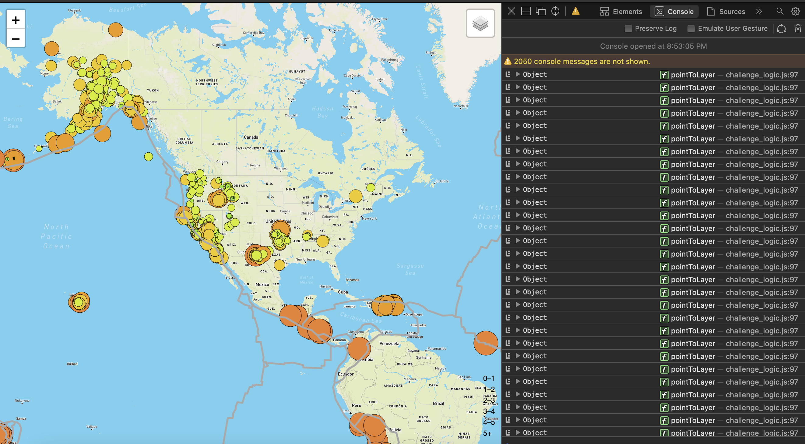
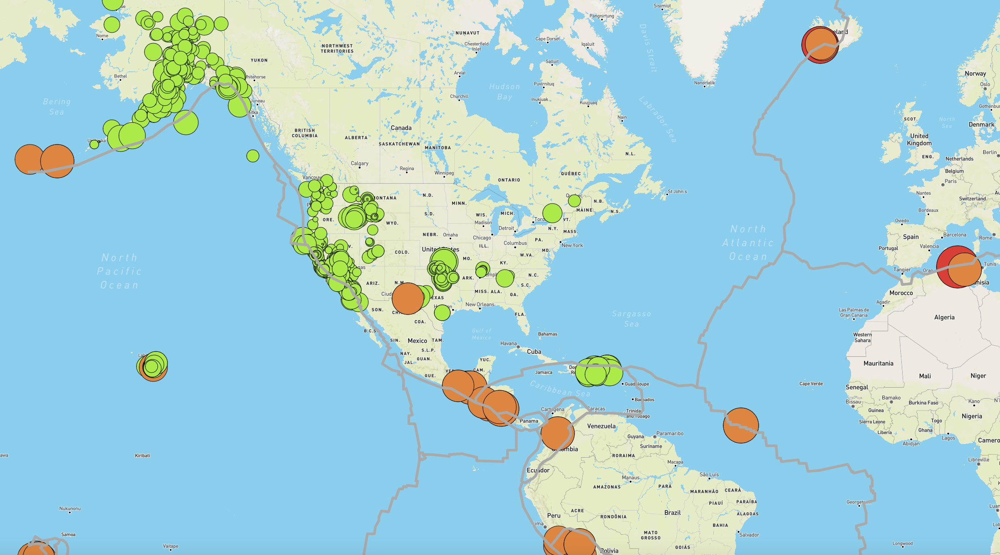

# Mapping_Earthquakes

This challenge utilizes *Leaflet* map layers to plot multi-layered maps with javascript. More to come in the future.  

First layer: tectonic plates:  

Second layer: major earthquakes of magnitude greater than 4.5:  
